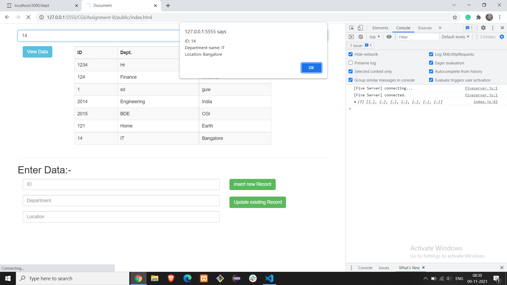
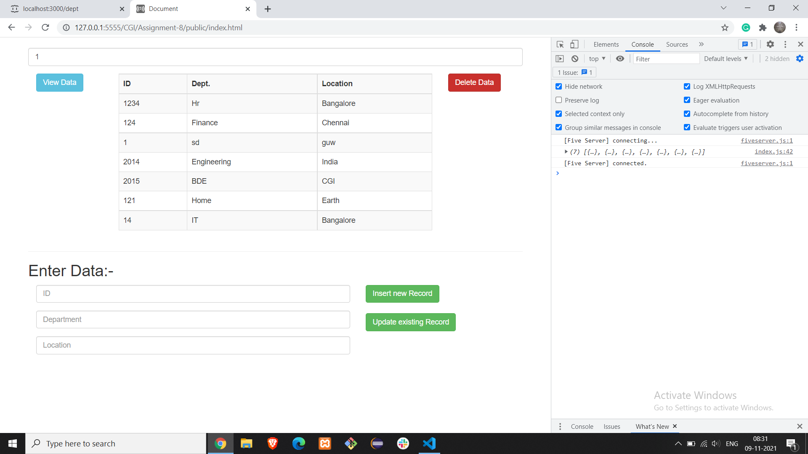
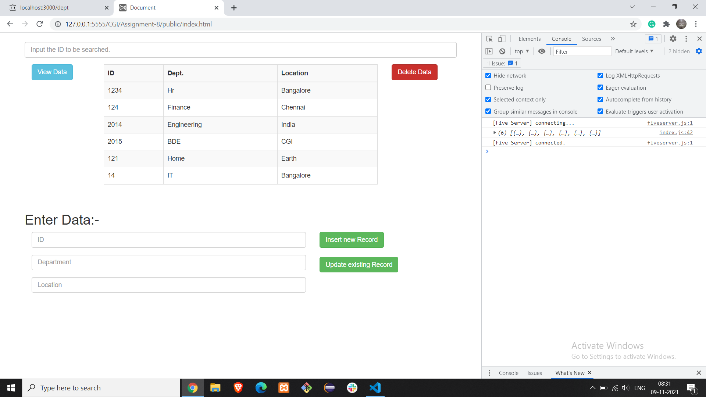
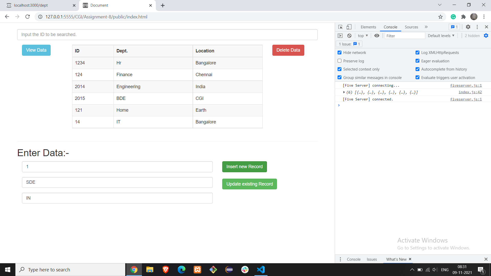
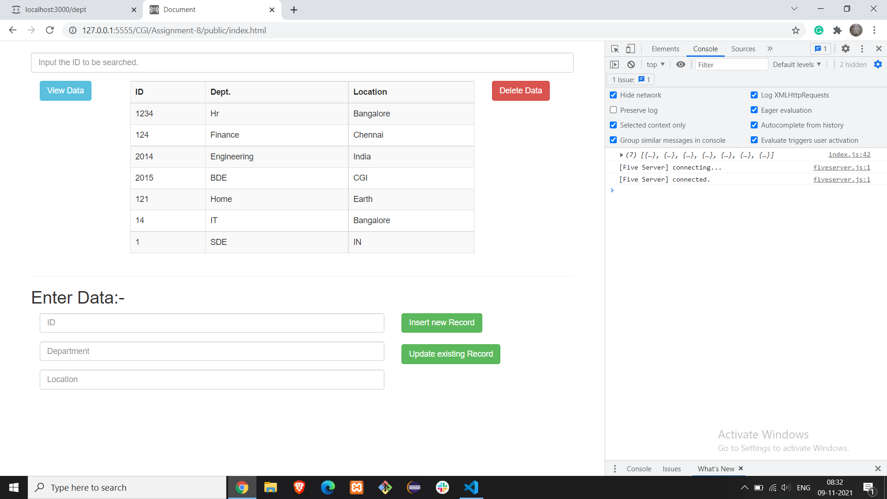
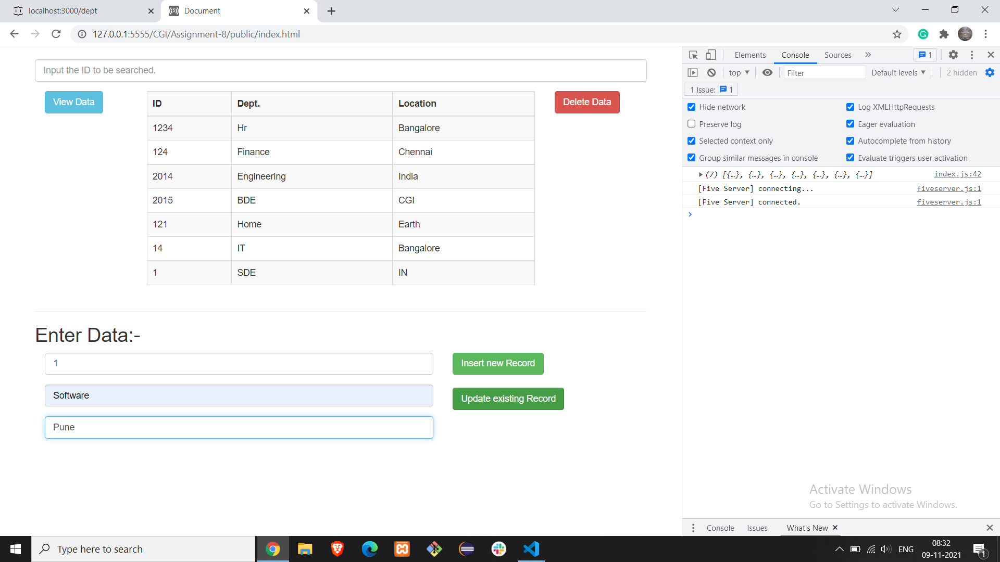

<h6>Name: <b>Deepak Kumar Mandal</b></h6>
<h6>Email: <b>dkm.iit.g@gmail.com</b></h6>

Date: 08-11-2021

 
<h2>Topic: JSON server + JavaScript</h2>
<h6><b>index.html Page Refresh is necessary to Obtained desired result</b></h6>

