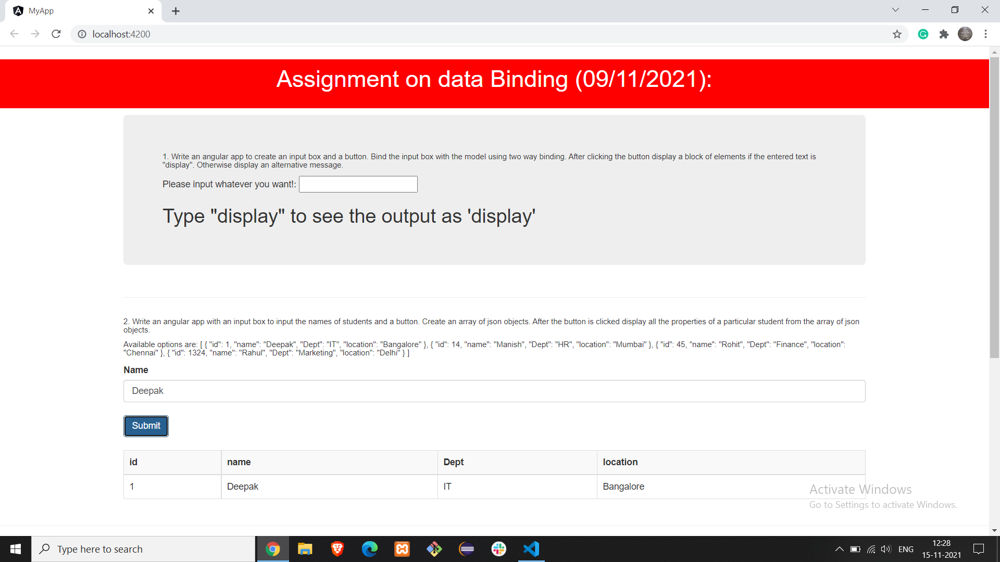

<h6>Name: <b>Deepak Kumar Mandal</b></h6>
<h6>Email: <b>dkm.iit.g@gmail.com</b></h6>

 
Assignment on data Binding (09/11/2021): 
 1. Write an angular app to create an input box and a button. Bind the input box with the model using two way binding. After clicking the button display a block of elements if the entered text is "display". Otherwise display an alternative message. 

 2. Write an angular app with an input box to input the names of students and a button. Create an array of json objects. After the button is clicked  display all the properties of a particular student from the array of json objects. 

 3. Create an angular component that displays two buttons namely like, dislike and also an element to display count. The like count must be  incremented by one when the like button is clicked and decremented when the dislike button is clicked. The count must not decreased below 0.      
 

 

# MyApp

This project was generated with [Angular CLI](https://github.com/angular/angular-cli) version 13.0.1.

## Development server

Run `ng serve` for a dev server. Navigate to `http://localhost:4200/`. The app will automatically reload if you change any of the source files.

## Code scaffolding

Run `ng generate component component-name` to generate a new component. You can also use `ng generate directive|pipe|service|class|guard|interface|enum|module`.

## Build

Run `ng build` to build the project. The build artifacts will be stored in the `dist/` directory.

## Running unit tests

Run `ng test` to execute the unit tests via [Karma](https://karma-runner.github.io).

## Running end-to-end tests

Run `ng e2e` to execute the end-to-end tests via a platform of your choice. To use this command, you need to first add a package that implements end-to-end testing capabilities.

## Further help

To get more help on the Angular CLI use `ng help` or go check out the [Angular CLI Overview and Command Reference](https://angular.io/cli) page.
