<h6>Name: <b>Deepak Kumar Mandal</b></h6>
<h6>Email: <b>dkm.iit.g@gmail.com</b></h6>

Date: 02-11-2021

 
<h1>Web Design of Native place (using Bootstrap v4.0)</h1>
<b>Result:-</b>

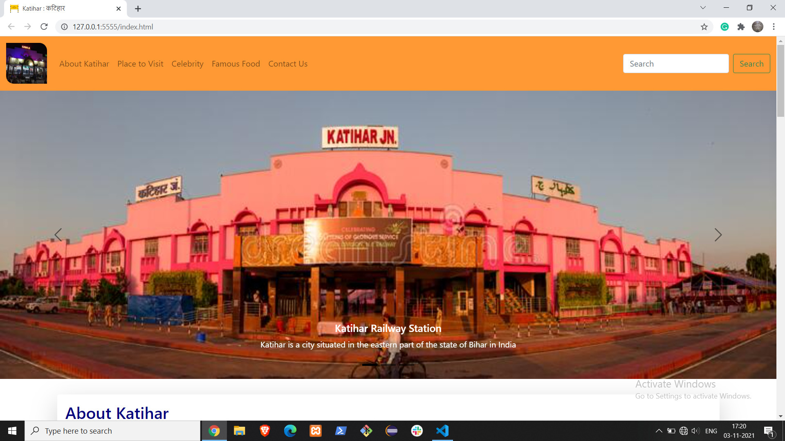

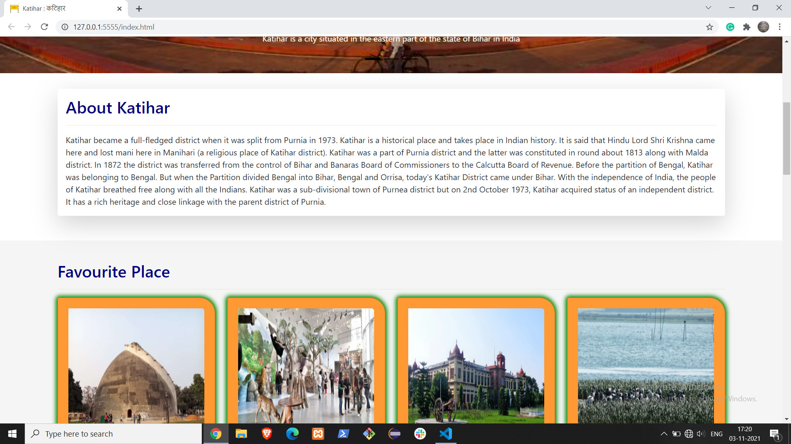

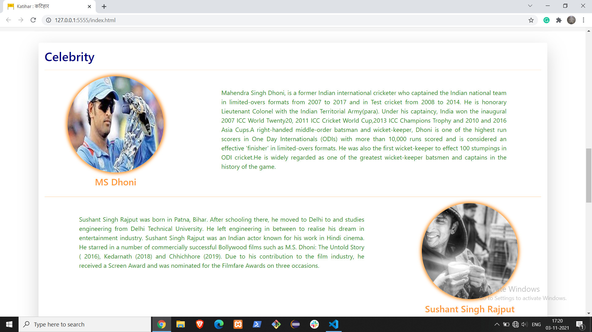

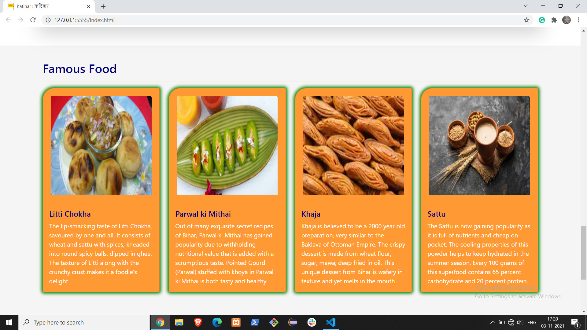

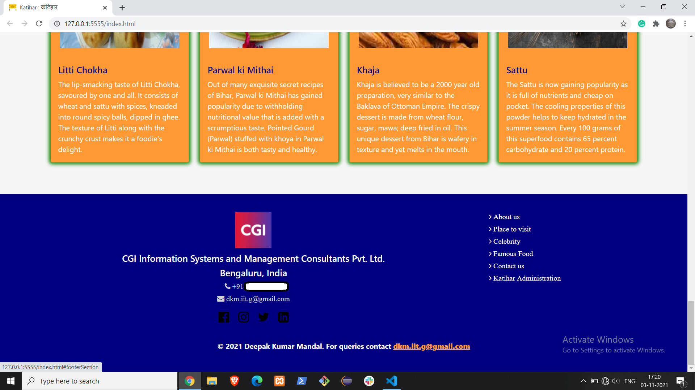

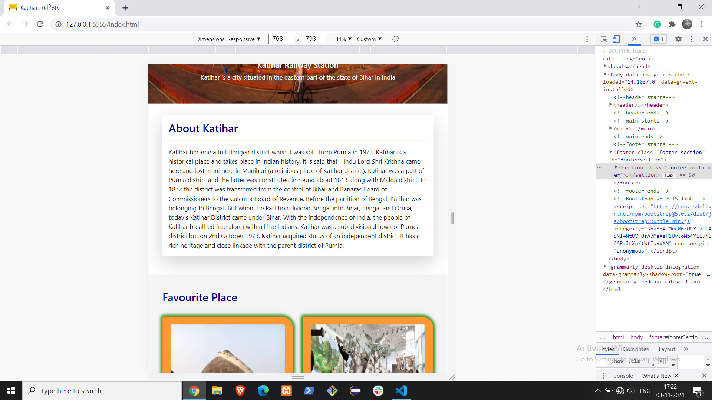

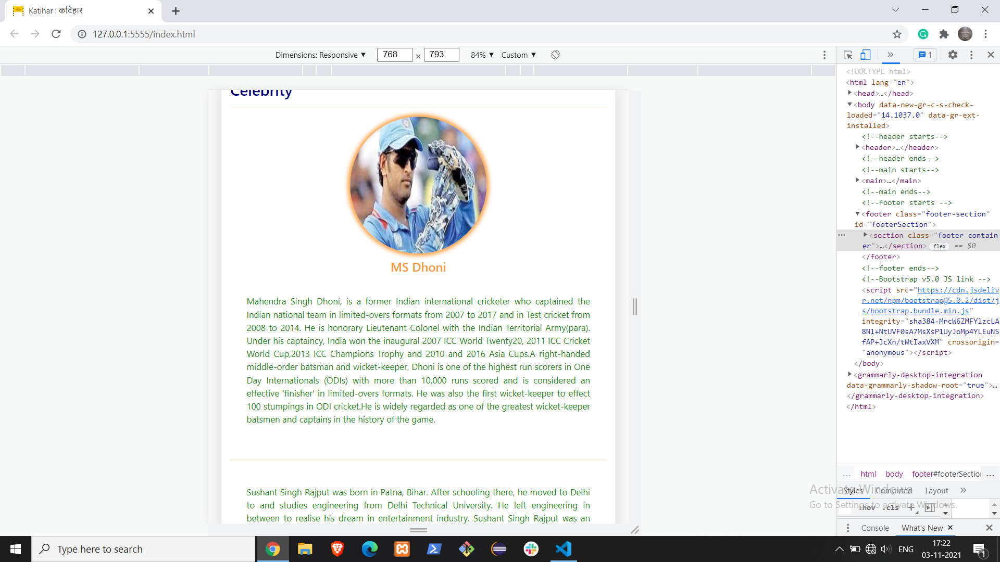

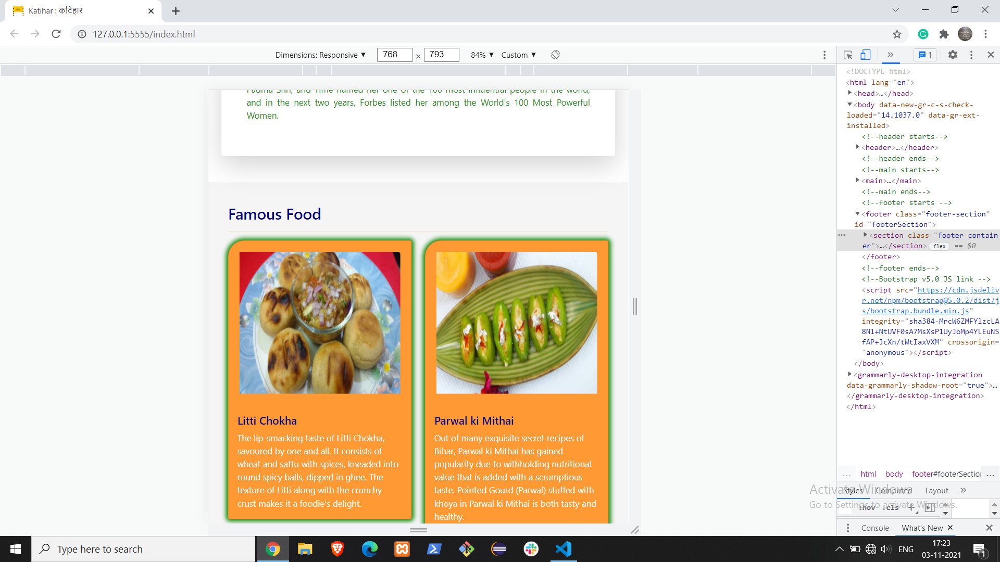

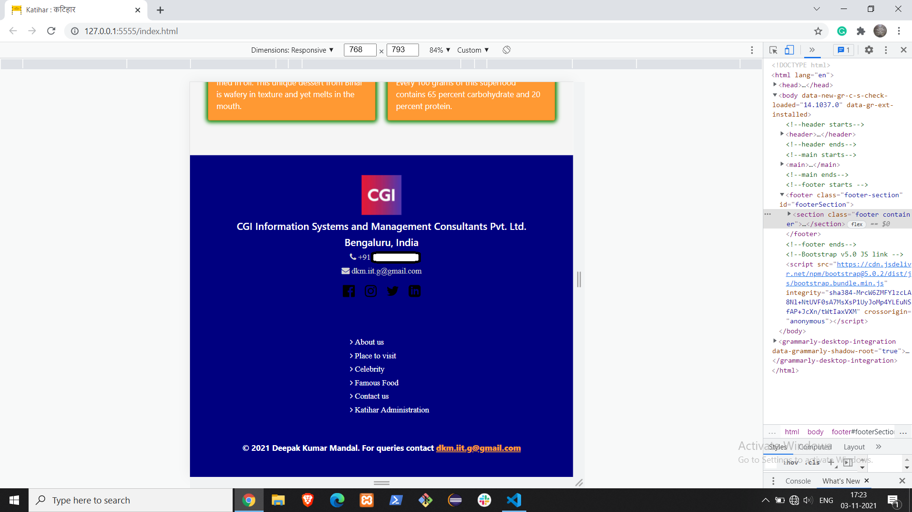

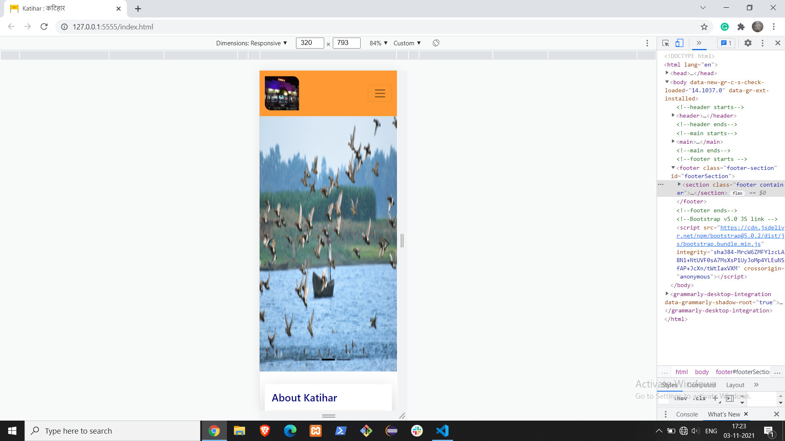

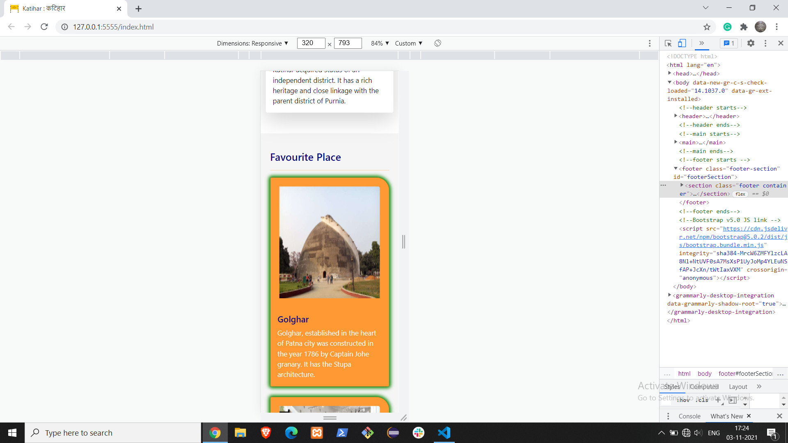

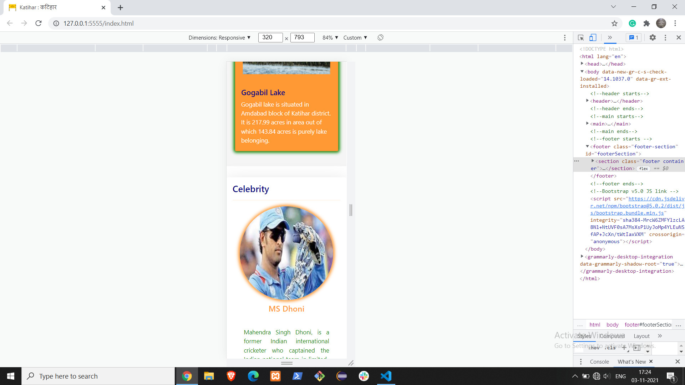

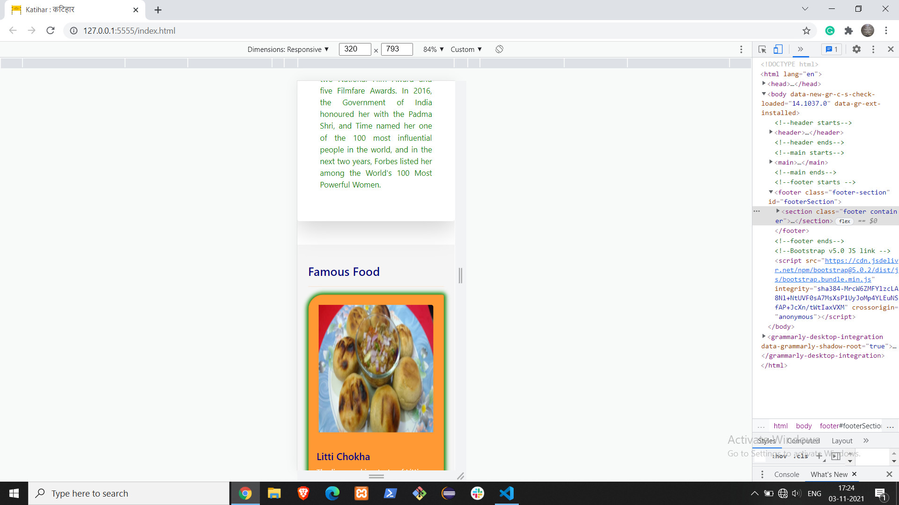

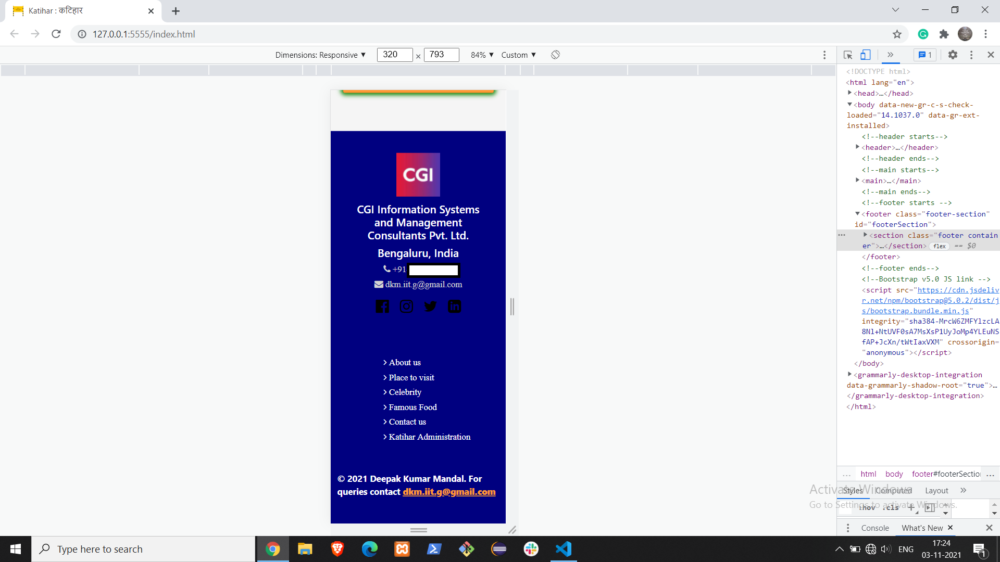

