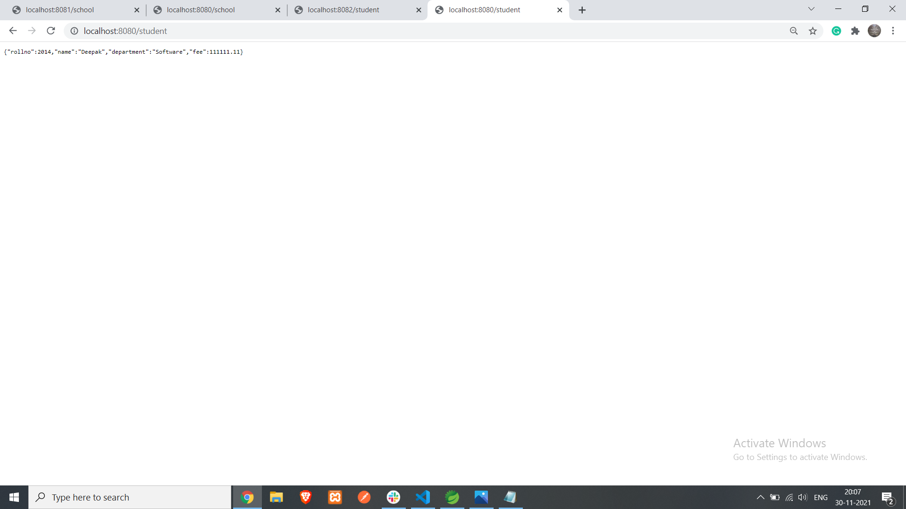
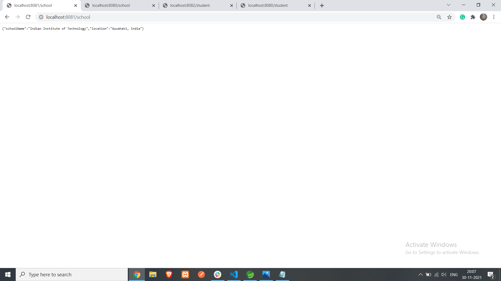

<h1>Deepak Kumar Mandal</h1>
<h6>dkm.iit.g@gmail.com</h6>

Date: 01-12-2021

Microservices-2 GateWay API

Create a following services 
 
   1. Gateway API --- 8080 
   2. SchoolService -------8081 
   3. StudentService-------8082 
 
Client Request must be accessed from the Gateway API  
 
Push the code in a repo and give the access. 

